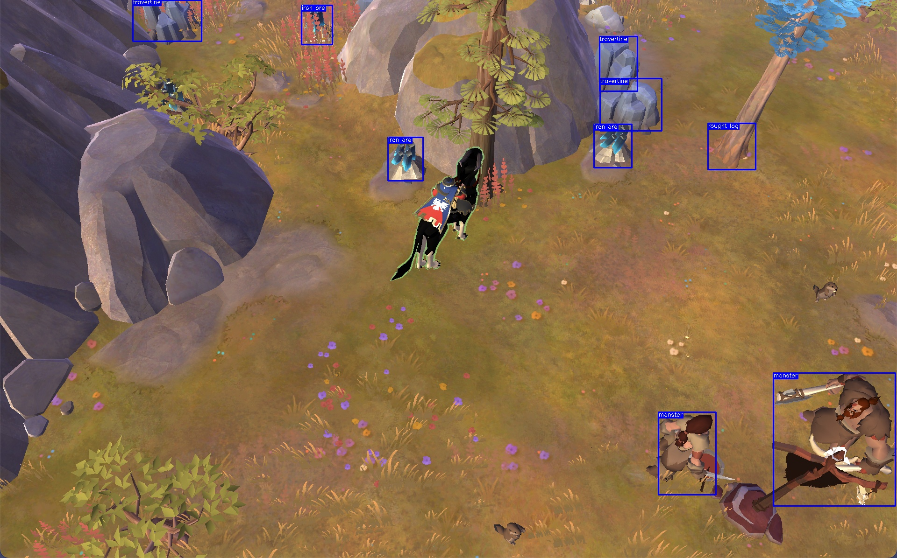

### Albion Gathering Bot: Amélioré

Bot de récolte amélioré pour Albion Online avec détection d'objets YOLOv5 et fonctionnalités avancées anti-détection.



## Table des matières

1. [À propos du projet](#à-propos-du-projet)
   - [Fonctionnalités](#fonctionnalités)
   - [Technologies utilisées](#technologies-utilisées)
2. [Démarrage](#démarrage)
   - [Prérequis](#prérequis)
   - [Installation](#installation)
3. [Utilisation](#utilisation)
   - [Modes de fonctionnement](#modes-de-fonctionnement)
   - [Options de configuration](#options-de-configuration)
   - [Système anti-détection](#système-anti-détection)
4. [Fonctionnalités avancées](#fonctionnalités-avancées)
   - [Gestion d'inventaire](#gestion-dinventaire)
   - [Comportements humains](#comportements-humains)
5. [Contribution](#contribution)
6. [Licence](#licence)
7. [Contact](#contact)
8. [Remerciements](#remerciements)

## À propos du projet

Ce projet est une version améliorée du bot de récolte Albion Gathering Bot. Il utilise la détection d'objets avec YOLOv5 pour repérer automatiquement les ressources dans le jeu Albion Online et les récolter efficacement, tout en évitant la détection par l'anti-cheat.

L'objectif est d'explorer les techniques de vision par ordinateur et d'apprentissage automatique pour l'automatisation des tâches dans les jeux, tout en implémentant des mécanismes avancés pour simuler un comportement humain et éviter la détection.

### Fonctionnalités

- **Détection de ressources améliorée** : Utilise YOLOv5 avec des seuils de confiance ajustables
- **Gestion d'inventaire** : Détecte quand l'inventaire est plein
- **Système anti-détection avancé** :
  - Mouvements de souris imitant le comportement humain
  - Délais randomisés pour éviter les schémas détectables
  - Protection contre les analyses de mémoire
  - Surveillance active de l'anti-cheat
- **Interface en ligne de commande enrichie** : Multiples options et modes de fonctionnement
- **Robustesse accrue** : Gestion améliorée des erreurs et des cas limites
- **Logging détaillé** : Suivi complet des opérations pour le débogage

### Technologies utilisées

- Python 3.8+
- PyTorch et YOLOv5
- OpenCV pour le traitement d'images
- PyAutoGUI pour l'automatisation de la souris et du clavier
- MSS pour la capture d'écran
- Logging pour le suivi des opérations
- PyWin32 pour l'interaction avec les fenêtres (Windows)
- Psutil pour la surveillance des processus

## Démarrage

### Prérequis

- Python 3.8 ou supérieur
- Albion Online installé
- Une connexion Internet pour la configuration initiale
- Windows 10/11 (support Windows exclusif dans cette version)

### Installation

1. Clonez le dépôt :
   ```bash
   git clone https://github.com/Michelprogram/albion-gathering-bot.git
   cd albion-gathering-bot
   ```

2. Installez les dépendances :
   ```bash
   pip install -r requirements.txt
   ```

3. Téléchargez le dataset d'entraînement depuis Roboflow (optionnel si vous souhaitez entraîner votre propre modèle) :
   [https://universe.roboflow.com/albiononline-c8fxi/albiongathering](https://universe.roboflow.com/albiononline-c8fxi/albiongathering)

## Utilisation

### Modes de fonctionnement

Le bot propose trois modes de fonctionnement principaux :

1. **Mode récolte (`gather`)** : Mode principal pour la récolte automatique des ressources
   ```bash
   python main.py --mode gather
   ```

2. **Mode débogage (`debug`)** : Visualise la détection sans action automatique
   ```bash
   python main.py --mode debug
   ```

3. **Mode test (`test`)** : Vérifie la configuration et les fonctionnalités de base
   ```bash
   python main.py --mode test
   ```

### Options de configuration

Le bot offre plusieurs options de configuration :

```bash
python main.py --help
```

Options principales :
- `--confidence` : Seuil de confiance pour la détection (0.0-1.0)
- `--max-resources` : Nombre maximal de ressources à récolter avant de s'arrêter
- `--max-time` : Durée maximale en minutes avant de s'arrêter
- `--window-name` : Nom de la fenêtre du jeu (par défaut: "Albion Online Client")
- `--model` : Chemin vers le fichier modèle YOLOv5 (par défaut: "best.pt")

Options anti-détection :
- `--safe-mode` : Active un mode encore plus sécurisé avec des mouvements plus humains
- `--disable-anti-detection` : Désactive les fonctionnalités anti-détection (non recommandé)
- `--memory-protection` : Active la protection de la mémoire contre les scans (expérimental)

### Système anti-détection

Le bot intègre un système avancé pour éviter la détection par l'anti-cheat :

1. **Mouvements humains** : Trajectoires de souris non linéaires avec variations de vitesse
2. **Délais randomisés** : Temps d'attente variables entre les actions
3. **Surveillance de l'anti-cheat** : Détection de la présence d'EAC et ajustement du comportement
4. **Protection mémoire** : Techniques pour compliquer les analyses de mémoire
5. **Micro-activités** : Génération de mouvements subtils pendant les périodes d'inactivité

## Fonctionnalités avancées

### Gestion d'inventaire

Le bot surveille approximativement le niveau de remplissage de l'inventaire basé sur le nombre de ressources récoltées. Quand l'inventaire est considéré comme plein, le bot s'arrête pour éviter de perdre du temps.

Configuration :
```python
# Dans la classe Interaction
INVENTORY_LIMIT = 15  # Nombre approximatif de ressources avant inventaire plein
```

### Comportements humains

Le bot imite les comportements humains pour éviter la détection :

- Variations aléatoires des coordonnées de clic
- Délais variables entre les actions
- Pauses occasionnelles lors de longues sessions
- Rotation de caméra naturelle pour chercher des ressources
- Vérification intelligente de la progression de la récolte

## Contribution

Les contributions sont ce qui fait de la communauté open source un endroit incroyable pour apprendre, s'inspirer et créer. Toute contribution que vous apportez est **grandement appréciée**.

Si vous avez une suggestion pour améliorer ce projet, merci de fork le dépôt et de créer une pull request. Vous pouvez aussi simplement ouvrir une issue avec le tag "enhancement". N'oubliez pas de donner une étoile au projet ! Merci encore !

1. Fork le projet
2. Créez votre branche de fonctionnalité (`git checkout -b feature/AmazingFeature`)
3. Commitez vos changements (`git commit -m 'Add some AmazingFeature'`)
4. Push vers la branche (`git push origin feature/AmazingFeature`)
5. Ouvrez une Pull Request

## Licence

Distribué sous la licence MIT. Voir `LICENSE.txt` pour plus d'informations.

## Contact

Pour me contacter : [gauron.dorian.pro@gmail.com](mailto:gauron.dorian.pro@gmail.com)

Lien du projet : [https://github.com/Michelprogram/albion-gathering-bot](https://github.com/Michelprogram/albion-gathering-bot)

## Remerciements

Ressources utiles et crédits :

- [Roboflow](https://roboflow.com/) - Pour la gestion des datasets
- [YOLOv5](https://github.com/ultralytics/yolov5) - Pour le modèle de détection d'objets
- [OpenCV](https://opencv.org/) - Pour le traitement d'images
- [PyAutoGUI](https://pyautogui.readthedocs.io/) - Pour l'automatisation de la souris et du clavier

---

⚠️ **Avertissement** : Ce bot a été créé à des fins éducatives et expérimentales uniquement. L'utilisation de bots dans Albion Online va à l'encontre des conditions d'utilisation du jeu et peut entraîner la suspension ou le bannissement de votre compte. Utilisez ce logiciel à vos propres risques.
